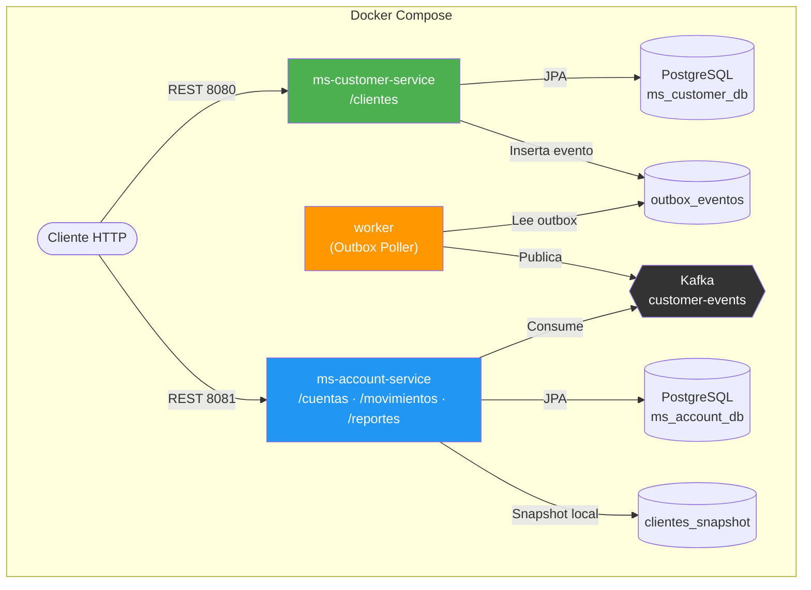
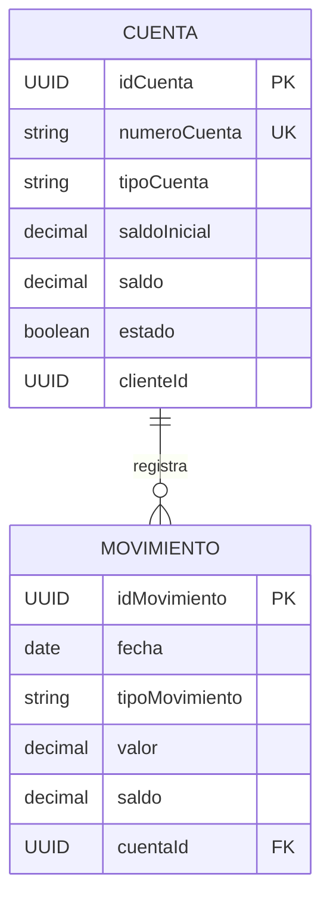

# ms-account-service

Microservicio responsable de la gestión de cuentas bancarias y movimientos transaccionales. Administra las entidades **CUENTA** y **MOVIMIENTO**, exponiendo endpoints REST en `/cuentas`, `/movimientos` y `/reportes`.

## Responsabilidades

- Creación y gestión de cuentas bancarias asociadas a un cliente
- Registro de depósitos y retiros con validación de saldo
- Generación de reportes de estado de cuenta por rango de fechas
- Comunicación inter-servicio con ms-customer-service (con Circuit Breaker)

## Diagrama de Arquitectura



## Diagrama Entidad-Relación


## Despliegue con Docker Compose

Este microservicio se despliega junto con toda la infraestructura (PostgreSQL, Kafka, worker y ms-customer-service) mediante Docker Compose.
El archivo `docker-compose.yml` se encuentra en el repositorio **ms-customer-service**, dentro de la carpeta `docker/`.

```bash
# Desde el directorio ms-customer-service/docker
cd ../ms-customer-service/docker
docker compose up --build
```

Consulta la guía completa de despliegue en: **ms-customer-service/docker/README.md**

## Cómo ejecutar localmente (sin Docker)

### Prerrequisitos

| Herramienta | Versión mínima |
|-------------|----------------|
| Java        | 17             |
| Gradle      | Wrapper incluido |
| PostgreSQL  | 13+            |

> **Nota:** Este servicio requiere que `ms-customer-service` esté en ejecución para la comunicación inter-servicio.

### 1. Configurar la base de datos

Crea una base de datos en PostgreSQL:

```sql
CREATE DATABASE ms_account_db;
```

### 2. Configurar `application.properties`

Edita `src/main/resources/application.properties` con tus credenciales:

```properties
spring.application.name=ms-account-service

spring.datasource.url=jdbc:postgresql://localhost:5432/ms_account_db
spring.datasource.username=tu_usuario
spring.datasource.password=tu_contrasena
spring.datasource.driver-class-name=org.postgresql.Driver

spring.jpa.hibernate.ddl-auto=update
spring.jpa.show-sql=true
spring.jpa.properties.hibernate.dialect=org.hibernate.dialect.PostgreSQLDialect

server.port=8082

# URL del servicio de clientes
ms.customer-service.url=http://localhost:8081
```

### 3. Compilar el proyecto

> **Nota:** Este proyecto usa **Gradle Groovy DSL** (`build.gradle`). Requiere Gradle Wrapper incluido; no es necesario tener Gradle instalado globalmente.

```bash
./gradlew clean build
```

### 4. Ejecutar el proyecto

```bash
./gradlew bootRun
```

O directamente con el JAR generado:

```bash
java -jar build/libs/ms-account-service-0.0.1-SNAPSHOT.jar
```

### 5. Verificar

El servicio estará disponible en: `http://localhost:8082`

Endpoints principales:
- `GET  /cuentas` — lista todas las cuentas
- `GET  /cuentas/{id}` — obtiene una cuenta por ID
- `POST /cuentas` — crea una nueva cuenta
- `PUT  /cuentas/{id}` — actualiza una cuenta
- `DELETE /cuentas/{id}` — eliminación lógica de una cuenta
- `POST /movimientos` — registra un depósito o retiro
- `GET  /movimientos` — lista todos los movimientos
- `GET  /reportes?clienteId={id}&fechaInicio={fecha}&fechaFin={fecha}` — reporte de estado de cuenta

### Ejecutar pruebas

```bash
./gradlew test
```

### Calidad de código

```bash
# Análisis completo (tests + checkstyle + PMD + JaCoCo)
./gradlew clean test checkstyleMain pmdMain jacocoTestReport

# Ver reporte de cobertura
open build/reports/jacoco/html/index.html

# Ver reporte Checkstyle
open build/reports/checkstyle/main.html

# Ver reporte PMD
open build/reports/pmd/main.html
```

> Umbral mínimo de cobertura: **90%** (verificado con JaCoCo 0.8.12). Checkstyle 10.21.4 y PMD 7.10.0 se ejecutan sobre el código fuente principal.
